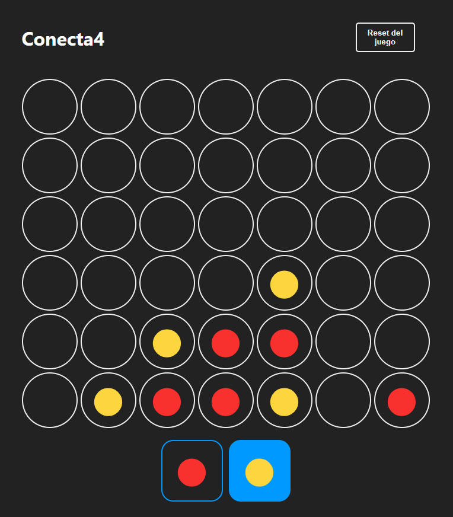

# Conecta4

Proyecto de Conecta4 creado con React. El objetivo del juego es ser el primer jugador en conectar cuatro fichas de tu color de forma vertical, horizontal o diagonal en el tablero.

[PRUÉBALO ACÁ](https://conecta4-winternacho.netlify.app "Conecta4")

